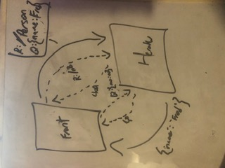
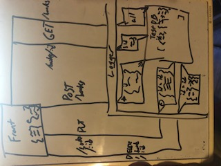

### LAB - Class 02

## Project: Lab 02/03
## Author: Julien Edwards

### Links and Resources

02
- [github](https://github.com/TrunkOfUkuleles/basic-express-server/pull/2)
- [Testing](https://github.com/TrunkOfUkuleles/basic-express-server/actions/runs/769292720) 

03
- [github](https://github.com/TrunkOfUkuleles/basic-express-server/pull/3)
- [Testing](https://github.com/TrunkOfUkuleles/basic-express-server/actions) 

### Setup

#### `.env` requirements (when applicable)

- `PORT` = 3000 || 3333

#### How to initialize/run your application (where applicable)

- `npm run start`

#### Tests

- Testing was split between serevr and middleware. using supertest to ping the server with different requests to test the responses.

#### UML / Application Wiring Diagram

Link to an image of the UML for your application and response to events

02

03

